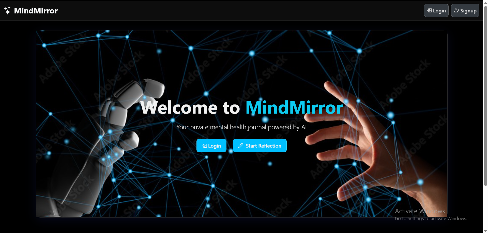
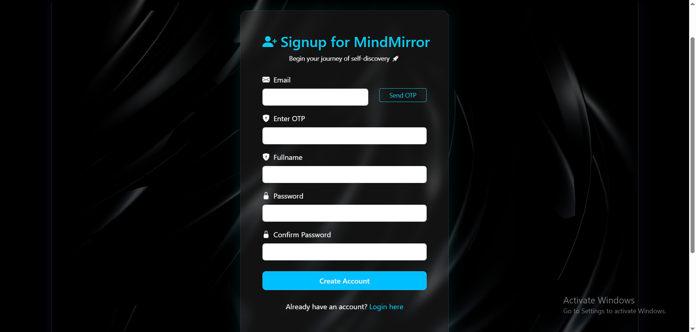
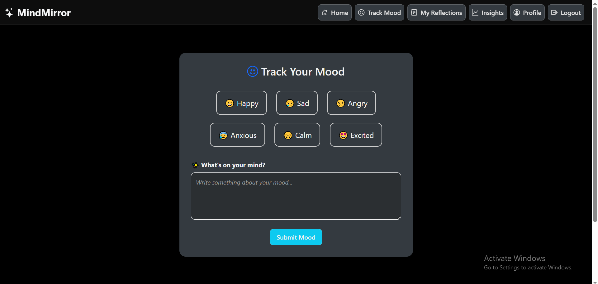
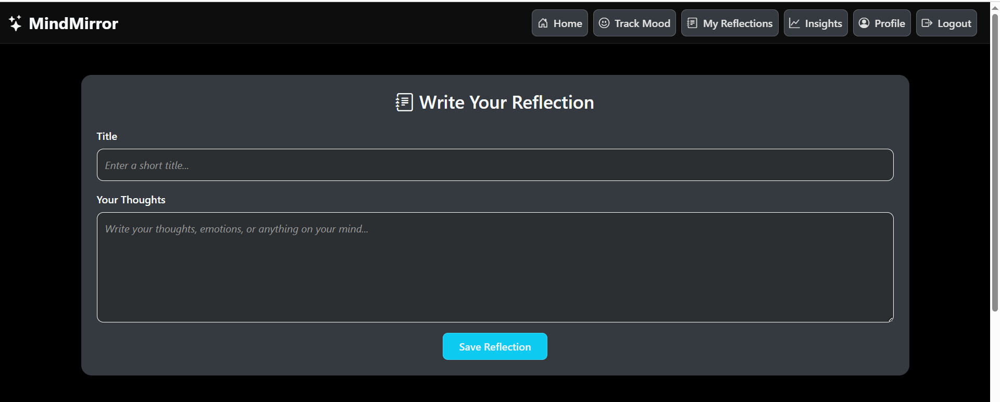
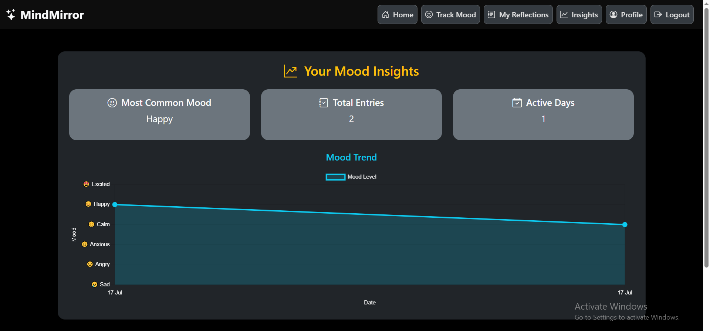

# 🧠 MindMirror – Your Personal Mental Wellness Tracker

**MindMirror** is an AI-inspired mental health journaling web app built with **Python, Django**, and **Bootstrap**, designed to help users understand their emotional patterns over time. It allows users to log daily moods, reflect with notes, and track their emotional trends via intuitive charts — all while ensuring secure OTP-based signup and login.

---

## 🔧 Tech Stack

- **Frontend**: HTML5, CSS3, JavaScript, Bootstrap 5
- **Backend**: Python, Django
- **Database**: SQLite3
- **Authentication**: Email-based OTP verification
- **Visualization**: Chart.js

---

## ✨ Features

- 📓 **Mood Journaling** – Users can log daily feelings with notes, creating a personal emotional diary.
- 🔐 **Email OTP Authentication** – Secure and reliable login/signup system using one-time passcodes.
- 📊 **Emotional Trend Visualization** – Beautiful, responsive charts (via Chart.js) to help users reflect on their emotional journey.
- 📱 **Responsive UI** – Designed mobile-first for smooth experience on phones, tablets, and desktops.
- 🧠 **Simple & Clean UX** – A distraction-free journaling interface to focus on self-awareness and clarity.

---

## 📸 Screenshots

### 🔹 Homepage

### 🔹 Signup with Email OTP

### 🔹 Track Your Mood

### 🔹 Reflective Journal Entry

### 🔹 Insights Dashboard

## 🚀 Getting Started

1. **Clone the Repository**  
bash
git clone https://github.com/CodeWithVikash1/MindMirror.git
cd MindMirror
